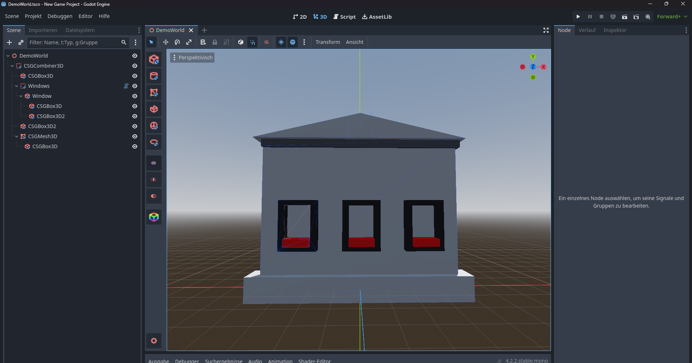

# CSG Toolkit - Enhance Your Blockout Speed
A godot plugin that will hopefully help you build quickler blockouts.
 <a href="https://godotengine.org/asset-library/asset/3057">>> Asset Library </a>
## Features
* <b>Quick Access Buttons:</b> Adds convenient buttons to the left toolbar for swiftly adding CSG nodes.
* <b>Efficient Child Node Addition:</b> Press SHIFT to instantly add the selected CSG as a child of the current CSG node.
* <b>Operation Preset:</b> Easily switch between different CSG operations.
* <b>Material Picker:</b> Quickly apply materials to CSG nodes.
* <b>Shortcut Integration:</b> Shortcuts are available when the selcted node is a CSG node.
* <b>CSG-Repeater:</b> A new Node that will repeat his first child node in given direction and set spacing.

## Planned Features
* <b>Additional Shapes:</b> Introducing new shapes to expand your design possibilities and enhance your creative flexibility.
* <b>CSG-(Combiner) to Single Mesh Converter:</b> Convert CSG nodes to mesh nodes.

### ! Note, after installing the plugin, you have to reload your project and enable the plugin in your Project Settings. 
 

 
 
Made with coffee and ♥

